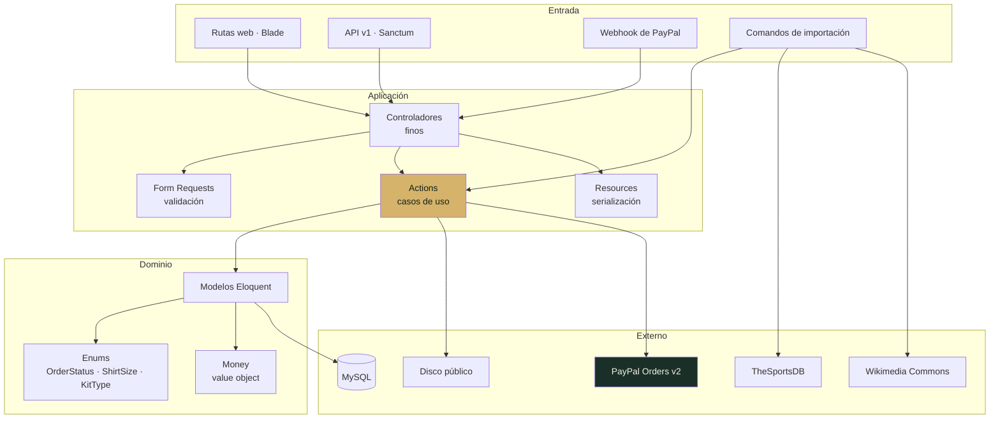
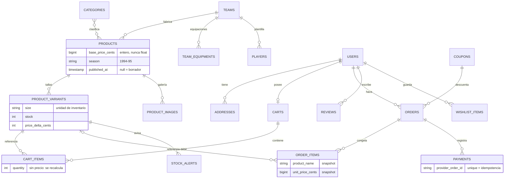
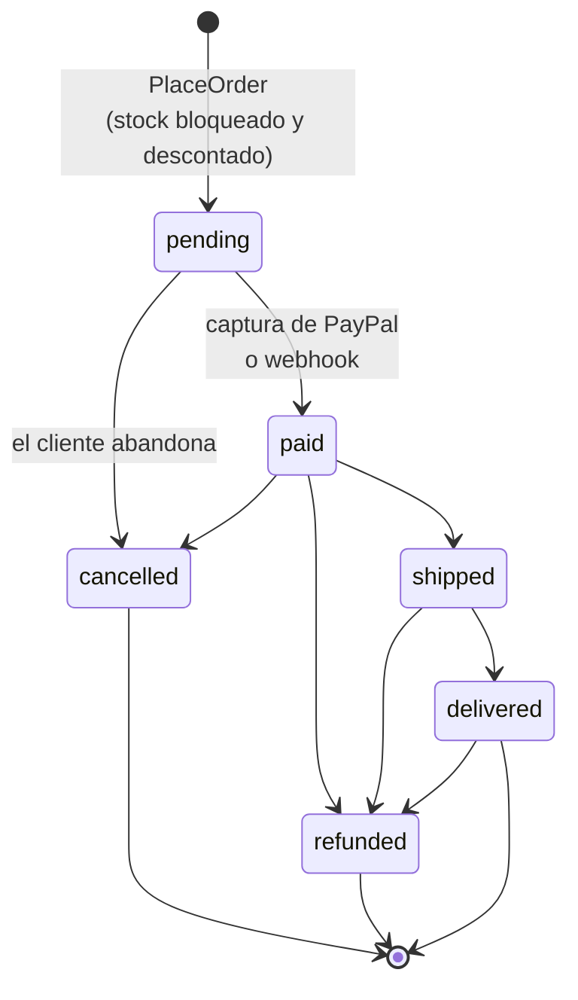
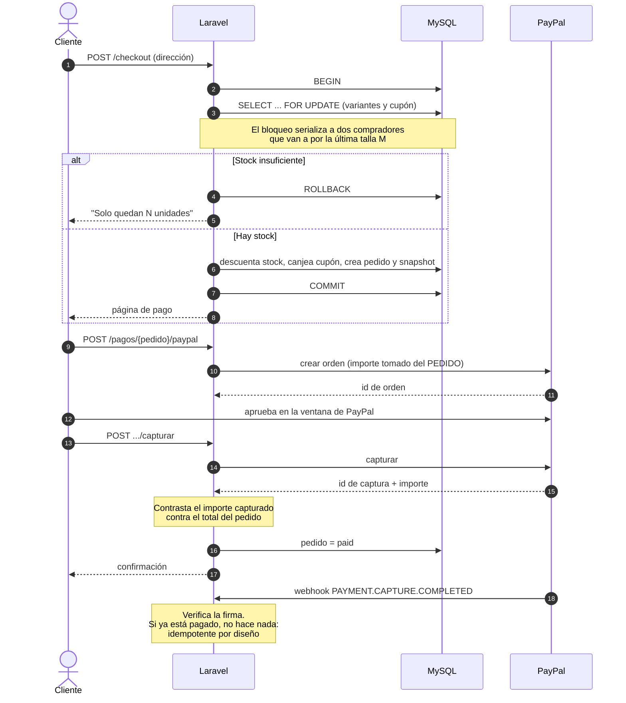
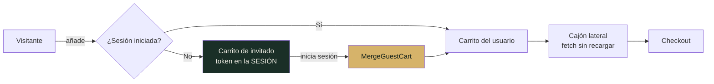
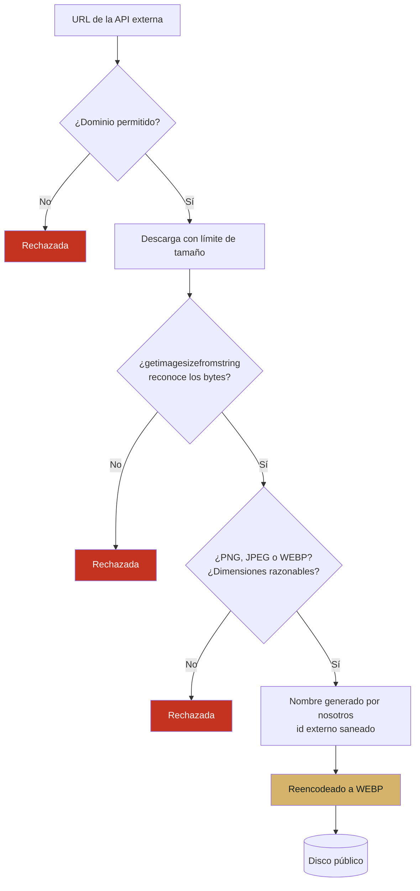
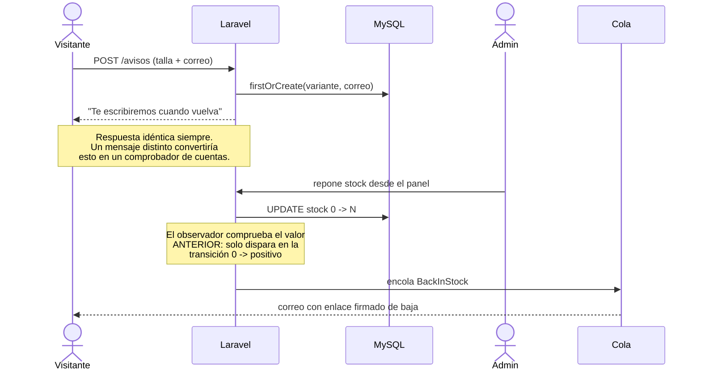

<h1 align="center">Elitewear XI</h1>

<p align="center">
  Ecommerce de camisetas retro de fútbol.<br>
  Laravel 13 · MySQL · Bootstrap 5 sobre Sass · PayPal sandbox · API REST versionada
</p>

[](https://github.com/Zoel-Manchon/elitewear-xi/actions/workflows/ci.yml)


<p align="center">
  <a href="https://github.com/Zoel-Manchon/elitewear-xi/actions/workflows/ci.yml">
    
  </a>
</p>


---

## Qué es

Una tienda completa de camisetas de época: catálogo importado desde APIs
públicas, carrito persistente, checkout con pasarela de pago, panel de
administración y API REST documentada.

Es un proyecto de portfolio con un sesgo deliberado hacia la **seguridad de
aplicación**. Cada decisión que cierra un vector de ataque está comentada en el
código y justificada aquí, y la suite de tests no comprueba que los botones
funcionen: comprueba que los ataques fallan.

**Credenciales de prueba:** `admin@retroshop.test` / `password`

---

## Capturas

### Tienda

| | |
|---|---|
| <br>**Catálogo** — filtros combinables con recuento por faceta | <br>**Ficha** — galería, tallas y stock real |
| <br>**Galería** — zoom a pantalla completa con PhotoSwipe | <br>**Carrito** — cajón lateral con progreso al envío gratis |
| <br>**Checkout** — cupón aplicado sobre el resumen | 

### Administración

| | |
|---|---|
| <br>**Panel** — ingresos, pedidos y stock bajo | <br>**Catálogo** — tallas, stock e imágenes |
| <br>**Auditoría** — quién cambió qué, cuándo y desde qué IP | <br>**API v1** — catálogo público en JSON |

---

## Arranque

### Con Docker

```bash
cp .env.example .env
npm ci
npm run build

docker compose down -v --remove-orphans   # primera instalación o reinicio total
docker compose build --no-cache app queue
docker compose up -d mysql redis app web
docker compose exec app php artisan key:generate --force
docker compose exec app php artisan migrate:fresh --seed --force
docker compose exec app php artisan optimize:clear
docker compose up -d queue
docker compose exec app php artisan catalog:doctor
```

La configuración de desarrollo de Compose usa una cuenta MySQL interna y
reproducible (`elitewear` / `secret`). No depende del usuario o contraseña que
tengas configurados para el MySQL de Windows. La imagen `app` incluye Composer,
por lo que pueden ejecutarse dentro del contenedor los mismos controles que CI:

```bash
docker compose exec app composer validate --strict --no-check-publish
docker compose exec app vendor/bin/phpstan analyse --no-progress
docker compose exec app vendor/bin/pint --test
docker compose exec app php artisan test
```

Para reconstruirlo entero desde cero, incluida la base de datos:

```bash
sh docker/reset.sh
```

En PowerShell:

```powershell
.\docker\reset.ps1
```

Para ejecutar antes del push los controles equivalentes a CI:

```powershell
.\docker\verify.ps1
```

En `http://localhost:8000`.

> **Si la página sale sin estilos**, borra `public/hot` y recompila. Ese fichero
> lo crea `npm run dev` para redirigir los assets al servidor de Vite; si queda
> ahí después de pararlo, `@vite` sigue apuntando a `127.0.0.1:5173` y todo
> falla por CORS.
>
> ```bash
> rm -f public/hot && npm run build && docker compose restart app
> ```

La imagen trae **GD compilado**, que es lo que necesita Intervention Image para
reencodear las imágenes descargadas de terceros. Es el motivo principal de que
haya Docker aquí: el entorno deja de depender de cómo tenga cada uno
configurado su PHP.

### Sin Docker

Requiere PHP 8.3+ con `gd`, `pdo_mysql`, `mbstring`, `intl`, `zip` y `exif`.

```bash
composer install
npm install && npm run build

cp .env.example .env
php artisan key:generate
php artisan migrate --seed
php artisan storage:link

php artisan serve
```

### Poblar el catálogo desde las APIs

```bash
php artisan catalog:sportsdb-full --all-countries --max-countries=15
php artisan kits:gallery --max=2      # segunda equipación por producto
php artisan teams:media --limit=40    # banner y fanart de cada club
php artisan players:import --max=6    # retratos de jugadores
```

### Si algo no arranca

| Síntoma | Causa | Arreglo |
|---|---|---|
| Página sin estilos | `public/hot` quedó de un `npm run dev` anterior | `rm -f public/hot && npm run build` |
| Catálogo vacío | La siembra no llegó a terminar, o los productos están sin publicar | `php artisan catalog:doctor` lo distingue y `--publish` lo corrige |
| Imágenes en 0 al importar | Falta `gd`, o la versión de Intervention Image no coincide | La imagen de Docker trae `gd`; el error aparece ahora en la columna de omitidas |
| Un cambio en el código no surte efecto | El Dockerfile copia el código en la imagen | Las carpetas de código van montadas en `docker-compose.yml`; si tocas `composer.json` sí hace falta `docker compose build` |
| `Connection refused` a MySQL | El `.env` apunta al MySQL del host | `docker-compose.yml` sobrescribe `DB_HOST` y `DB_PORT`; comprueba usuario y contraseña |

---

## Arquitectura



Los controladores no contienen lógica de negocio: validan con un Form Request,
delegan en una Action y serializan con un Resource. La única interfaz del
proyecto es `PaymentGateway`, y existe para poder sustituir PayPal por un doble
en los tests.

**No hay repositorios sobre Eloquent.** Eloquent ya es el repositorio; envolverlo
añade una capa que no desacopla nada real.

---

## Modelo de datos



Cuatro reglas sostienen todo lo demás:

| Regla | Por qué |
|---|---|
| Dinero en enteros de céntimos | Los `float` pierden precisión al sumar |
| `order_items` guarda snapshot | Un pedido histórico no puede cambiar si cambia el catálogo |
| `cart_items` **no** guarda precio | El carrito es intención; el pedido es contrato |
| El carrito referencia la *variante* | La talla es la unidad de inventario, no un atributo |

---

## Ciclo de vida de un pedido



La máquina de estados vive en `OrderStatus::canTransitionTo()`, no en el
controlador ni en el formulario. Un `POST` a mano con un estado arbitrario se
rechaza igual que un clic en la interfaz.

---

## Checkout y pago



El navegador nunca ve ni envía un importe. Lo único que puede manipular es el
identificador de la orden de PayPal, y el servidor lo contrasta contra el pedido
antes de dar nada por cobrado.

---

## Carrito



El token del carrito de invitado vive en la sesión, **nunca** en la URL ni en una
cookie propia. Si el cliente pudiera elegirlo, cambiar ese valor sería leer y
vaciar el carrito de otra persona: un IDOR de manual, y el fallo más común en
carritos hechos a mano.

---

## Importación desde APIs externas

El catálogo se nutre de **TheSportsDB** (equipaciones, escudos, plantillas) y
**Wikimedia Commons** (archivo retro). Es la parte del sistema por donde entra
contenido que no controlamos.



Todo pasa por `RemoteImageStore`, y el principio es explícito: **una imagen que
llega por HTTP no merece más confianza que una que sube un usuario**.

Hay un límite de píxeles además del de bytes: un PNG de 30 KB puede
descomprimirse a 40.000 × 40.000 y agotar la memoria al reencodearlo.

---

## Avisos de reposición



---

## Seguridad

| Control | Dónde | Qué cierra |
|---|---|---|
| Comprobación de propiedad del carrito | `CartController::authorizeItem()` | IDOR sobre líneas de carrito |
| Token de invitado en sesión | `CartResolver` | Robo de carrito por manipulación de parámetro |
| Whitelist de ordenación | `CatalogController::SORTS` | Inyección SQL vía `orderBy()` |
| Escape de `%` y `_` | Catálogo y buscador | Volcado del catálogo con `?q=%` |
| `abort_unless` sobre `published_at` | `CatalogController::show()` | Borradores visibles adivinando la URL |
| `is_admin` fuera de `#[Fillable]` | `User` | Escalada de privilegios desde `POST /register` |
| 404 en vez de 403 en `/admin` | `EnsureUserIsAdmin` | Enumeración del panel |
| Máquina de estados en el enum | `OrderStatus` | Saltarse el flujo con un POST manual |
| `lockForUpdate()` en el pedido | `PlaceOrder` | Sobreventa por concurrencia |
| `lockForUpdate()` sobre el cupón | `PlaceOrder` | Canje múltiple de un código de un solo uso |
| Descuento acotado al subtotal | `Coupon::discountFor()` | Totales negativos |
| Mensaje único de código inválido | `CouponController` | Búsqueda de cupones por fuerza bruta |
| Importe tomado del pedido | `PayPalGateway` | Manipulación del precio en el cliente |
| Contraste del importe capturado | `PaymentController` | Captura por debajo del total |
| `unique` en `provider_order_id` | Tabla `payments` | Webhooks duplicados |
| Verificación de firma del webhook | `PaymentController` | Webhooks falsificados |
| Nombre de fichero saneado | `RemoteImageStore` | Path traversal desde la respuesta de una API |
| Verificación real de los bytes | `RemoteImageStore` | `Content-Type` falsificado por el servidor remoto |
| Reencodeado a WEBP | `RemoteImageStore` | Cargas útiles tras cabecera de imagen válida |
| Límite de píxeles | `RemoteImageStore` | Agotamiento de memoria al descomprimir |
| Rechazo de SVG en subidas | `ProductRequest` | XSS por vector servido desde el propio origen |
| CSP con nonce y sin `unsafe-inline` | `SecurityHeaders` | XSS almacenado |
| `report-uri` en la CSP | `SecurityHeaders` | Política sin telemetría |
| `escapeHtml()` antes de `innerHTML` | `http.js` | XSS desde el catálogo |
| Escapado de etiquetas en JSON-LD | `shop/show.blade.php` | XSS con origen en TheSportsDB |
| Id de YouTube validado | `Team::youtubeId()` | Inyección desde una URL de tercero |
| `Password::uncompromised()` | `RegisterController` | Credenciales ya filtradas |
| Rate limiting por email + IP | `TokenController` | Fuerza bruta sobre la API |
| Mensaje único de error de login | `TokenController` | Enumeración de usuarios |
| Disponibilidad en vez de stock | `ProductVariantResource` | Fuga de información de negocio |
| Respuesta idéntica en avisos | `StockAlertController` | Comprobación de cuentas por correo |
| URL firmada para la baja | `BackInStock` | Bajas fabricadas por terceros |
| Registro de auditoría | `Auditable` | Cambios sin autor identificable |
| Secretos excluidos del registro | `Auditable::$auditExclude` | Filtración por el propio registro |

La CSP solo funciona porque **no hay JavaScript inline en ninguna vista**.
Galería, carrito, buscador y filtros viven en módulos importados por Vite.
Retrofitear eso más tarde es caro; hacerlo desde el principio es gratis.

---

## Bugs encontrados y cerrados

Los que enseñan algo, con la causa real y no el síntoma.

**Los filtros no devolvían nada al combinar dos.**
La condición era `$except !== 'tipo' && ($filters['tipo'] ?? null)`. En PHP, `&&`
devuelve **siempre un booleano**, así que el closure de `when()` recibía `true` en
lugar del slug y la consulta comparaba `slug = 1`. Con `decada`,
`substr(true, 0, 3)` daba `'1'` y `season LIKE '1%'` casaba con todo 1970-1999,
que es por lo que parecía funcionar a medias. Sobrevivió a tres revisiones porque
ningún test comprobaba que un filtro *devolviera* lo correcto, solo que la página
cargara. Hoy lo cubre `CatalogFilterTest` con ocho casos.

**Path traversal desde la respuesta de una API.**
El identificador externo de la equipación se concatenaba tal cual en la ruta del
fichero. Un id con `../` en la respuesta escribía fuera del directorio previsto.
Lo controla un tercero, no un usuario: es el tipo de entrada que se olvida
validar.

**XSS almacenado por JSON-LD.**
Los datos estructurados se serializaban con `JSON_UNESCAPED_SLASHES` dentro de un
`<script>`. Un `</script>` en el nombre de un producto —y los nombres vienen de
TheSportsDB— cerraba el bloque y ejecutaba lo que viniera detrás.

**Asignación masiva silenciosa, tres veces.**
`notified_at`, `is_approved` y `redemptions_count` fuera de `$fillable` hacían que
`update()` los descartara sin error. El síntoma siempre era el mismo: "esto no
guarda y no da ningún fallo". Cuando un `update()` no hace nada, `$fillable` es lo
primero que hay que mirar.

**Un directorio donde debía haber un fichero.**
`phpstan.neon` incluye `phpstan-baseline.neon`, pero ese nombre existía en el
repositorio como directorio vacío. PHPStan aborta al no poder leer un fichero
de `includes:`, así que el job de análisis estático fallaba sin producir un
solo error de análisis — el mensaje no decía nada del código. Los zips y Git no
conservan ficheros vacíos, y un `mkdir` accidental lo convierte en carpeta.

**Los tests contra la base de datos real.**
`phpunit.xml` declaraba `DB_CONNECTION=sqlite`, pero en Docker `env_file`
inyecta el `.env` como variables del proceso y PHPUnit no las sobrescribe. La
suite ejecutó `migrate:fresh` sobre MySQL y **borró el catálogo de desarrollo**.
Es la misma causa que tenía el CSRF activo en los tests y la validación DNS
haciendo consultas reales: tres síntomas sin relación aparente, una sola causa
de configuración. `TestCase::refreshApplication()` fuerza ahora SQLite en
memoria antes de que `RefreshDatabase` actúe.

**Desactivación en cascada del catálogo.**
Si la API no devolvía equipaciones, la lista de ids activos quedaba vacía, el
filtro no se aplicaba y el `update` alcanzaba a *todos* los productos del equipo.
Un fallo temporal de un tercero despublicaba el catálogo entero sin que nada lo
señalara.

---

## API

Documentación completa en [`docs/openapi.yaml`](docs/openapi.yaml).

```bash
# Catálogo público
curl http://localhost:8000/api/v1/products?team=afc-ajax

# Token
curl -X POST http://localhost:8000/api/v1/tokens \
  -H 'Content-Type: application/json' \
  -d '{"email":"tu@correo.com","password":"...","device_name":"cli"}'

# Pedidos
curl http://localhost:8000/api/v1/orders -H 'Authorization: Bearer <token>'
```

Versionada desde el primer día: `/api/v1` permite publicar una v2 sin romper a
quien ya consume la actual. Añadir la versión después es mucho más caro.

---

## Calidad

```bash
docker compose exec app php artisan test
docker compose exec app vendor/bin/phpstan analyse --no-progress
docker compose exec app vendor/bin/pint --test
docker compose exec app composer validate --strict --no-check-publish
docker compose exec app composer audit --locked --no-interaction
npm ci && npm run build && npm audit --audit-level=high
```


La suite no comprueba que los botones funcionen: comprueba que los ataques
fallan. Un IDOR contra una línea de carrito ajena, una ordenación con SQL
inyectado, un registro con `is_admin=1`, un pedido con más unidades de las que
hay en stock, un cupón de un solo uso canjeado dos veces, un polyglot con
cabecera PNG válida seguida de PHP.

CI en GitHub Actions: suite sobre SQLite en memoria, validación de migraciones
contra MySQL 8.4, Larastan nivel 5 con baseline incremental, Pint y auditoría de
dependencias PHP/npm. Los errores nuevos no incluidos en el baseline bloquean el push.

---

## Estructura

```
app/
├── Actions/          casos de uso (PlaceOrder, AddItemToCart, MergeGuestCart)
├── Console/Commands/ importadores del catálogo
├── Contracts/        PaymentGateway
├── Enums/            OrderStatus, ShirtSize, KitType, CouponType
├── Http/
│   ├── Controllers/  web, Admin/, Api/V1/
│   ├── Middleware/   EnsureUserIsAdmin, SecurityHeaders
│   ├── Requests/     validación
│   └── Resources/    serialización JSON
├── Models/           Eloquent
├── Notifications/    BackInStock
├── Observers/        ProductVariantObserver
├── Services/
│   ├── PayPal/       cliente de la pasarela
│   └── SportsData/   TheSportsDB, Commons, RemoteImageStore
├── Support/          Money, CartResolver, CouponSession, ShirtRenderer
└── Traits/           Auditable

resources/
├── js/               http, cart, search, gallery, filters, product, toast
├── sass/             _tokens, _variables, _components, app
└── views/            shop/, account/, admin/, partials/

docker/               nginx y php.ini
docs/                 openapi.yaml y capturas
```

---

## Próximos pasos

1. **2FA (TOTP) en el panel de admin**, con códigos de recuperación.
2. **Reseñas con moderación previa** en lugar de aprobación automática.
3. **Facturas en PDF** con numeración correlativa.
4. **Meilisearch** para el buscador: `LIKE` con comodín por delante no usa
   índices y no escala.

---

## Licencia

MIT. Las camisetas, escudos y nombres de club pertenecen a sus titulares; este
proyecto es una demostración técnica sin ánimo comercial.
