<h1 align="center">Elitewear XI</h1>

<p align="center">
  Retro football shirt ecommerce.<br>
  Laravel 13 · MySQL · Bootstrap 5 over Sass · PayPal sandbox · versioned REST API
</p>

<p align="center">
  <a href="https://github.com/Zoel-Manchon/elitewear-xi/actions/workflows/ci.yml"></a>
  
  
  
  
  
  
</p>

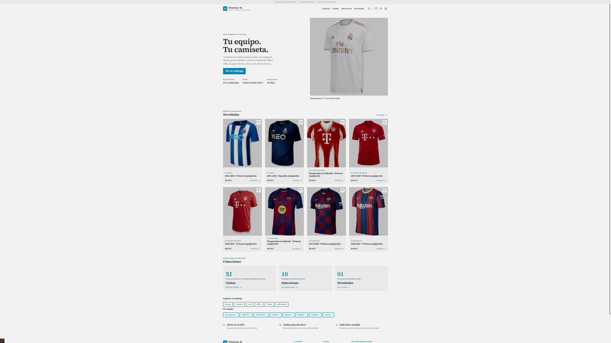

---

## At a glance

|  |  |
| --- | --- |
| **What it is** | A complete period-shirt shop: catalogue imported from public APIs, persistent cart, checkout with a payment gateway, admin panel and a documented REST API. |
| **The one idea** | The test suite does not check that the buttons work. **It checks that the attacks fail.** An IDOR against someone else's cart line, a sort with injected SQL, a registration carrying `is_admin=1`, an order for more units than exist, a single-use coupon redeemed twice, a polyglot with a valid PNG header followed by PHP. |
| **Built with** | Laravel 13 · PHP 8.3 · MySQL · Bootstrap 5 over Sass · Vite · PayPal Orders v2 |
| **Money** | Integer cents, never `float`. Orders snapshot their own prices, so history cannot be rewritten by editing the catalogue. |
| **Concurrency** | `lockForUpdate()` on variants and coupons: two buyers going for the last size M are serialised, not both sold. |
| **The browser** | Never sees or sends an amount. It can only manipulate a PayPal order id, and the server checks that against the order before treating anything as paid. |
| **Run it** | `docker compose up -d` → `http://localhost:8000` · `admin@retroshop.test` / `password` |

**Contents** — [Getting started](#getting-started) · [Architecture](#architecture) ·
[Data model](#data-model) · [Order lifecycle](#order-lifecycle) ·
[Checkout and payment](#checkout-and-payment) · [Cart](#cart) ·
[Importing from external APIs](#importing-from-external-apis) ·
[Security](#security) · [Bugs found and closed](#bugs-found-and-closed) ·
[API](#api) · [Quality](#quality) · [What is next](#what-is-next)

---

## What it is

A portfolio project with a deliberate bias towards **application security**. Every
decision that closes an attack vector is commented in the code and justified here.

---

## Screenshots

### Shop

| | |
|---|---|
| 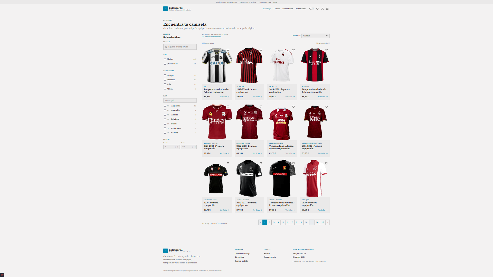<br>**Catalogue** — combinable filters with a count per facet | 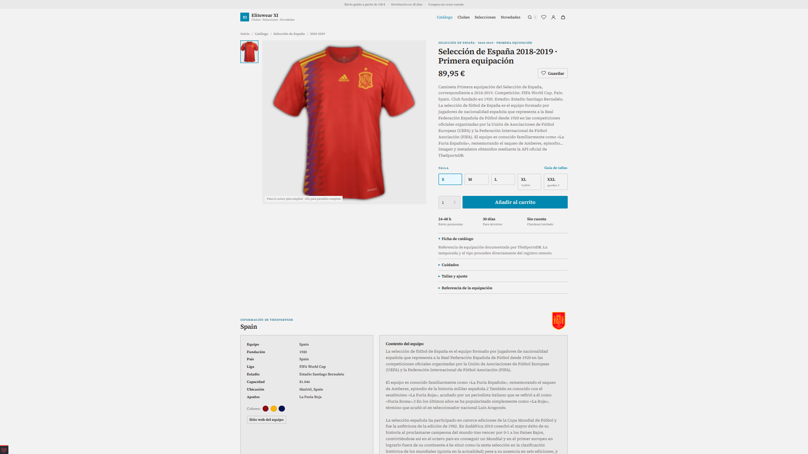<br>**Product** — gallery, sizes and real stock |
| 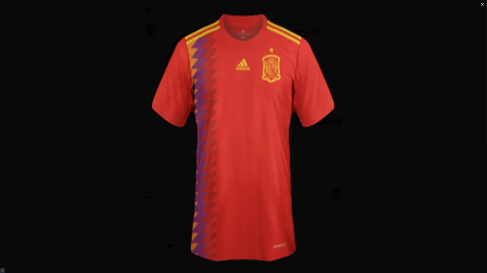<br>**Gallery** — full-screen zoom with PhotoSwipe | 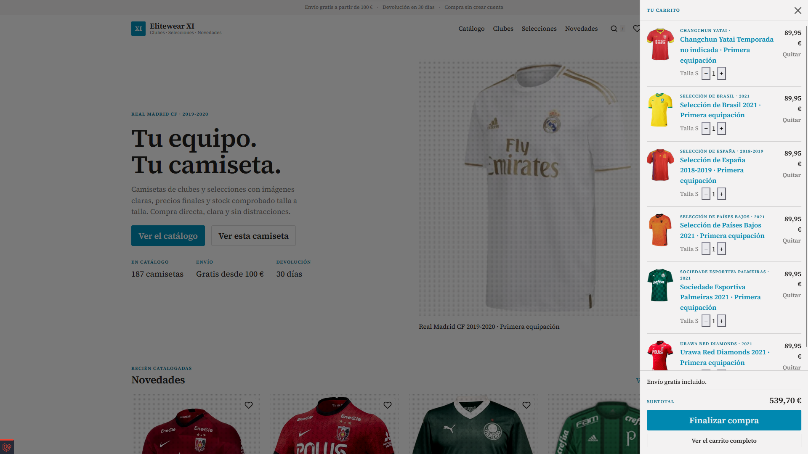<br>**Cart** — side drawer with free-shipping progress |
| 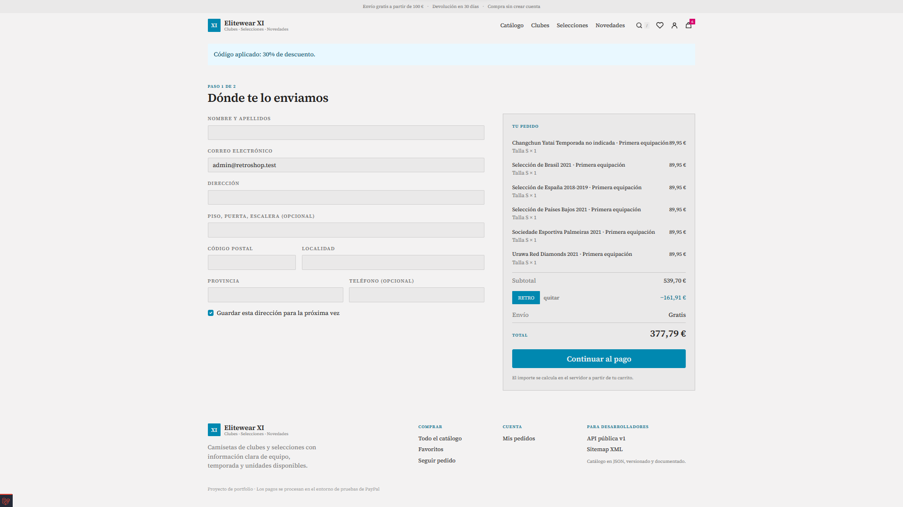<br>**Checkout** — coupon applied to the summary | |

### Admin

| | |
|---|---|
| 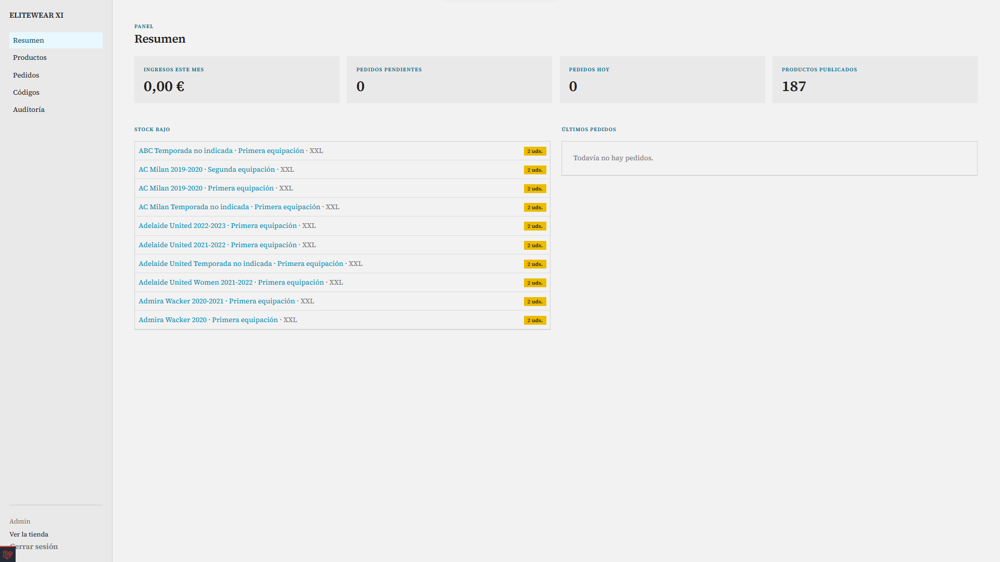<br>**Dashboard** — revenue, orders and low stock | 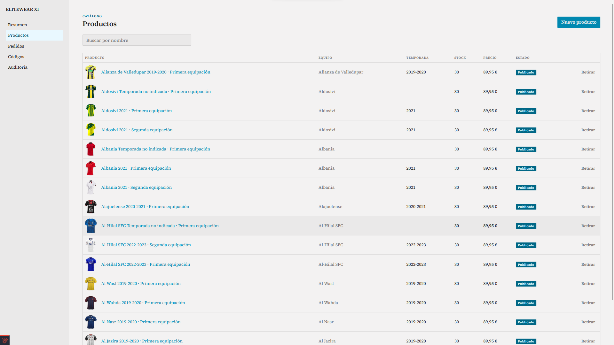<br>**Catalogue** — sizes, stock and images |
| 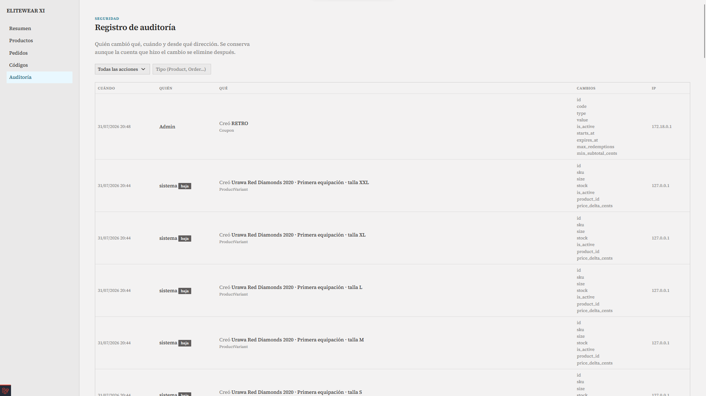<br>**Audit** — who changed what, when and from which IP | 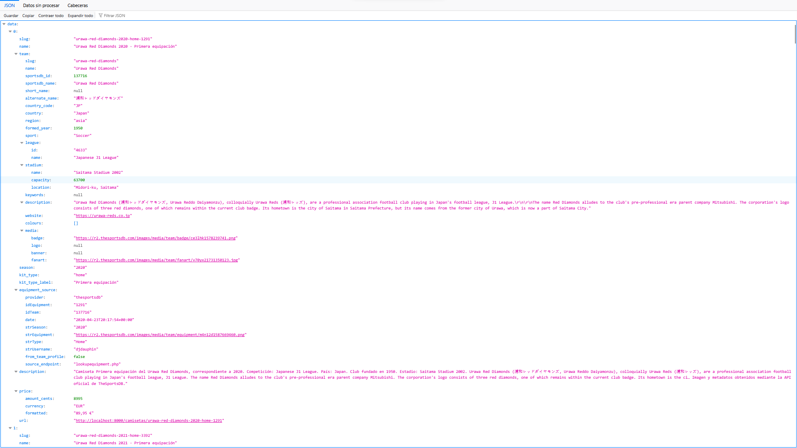<br>**API v1** — public catalogue as JSON |

---

## Getting started

### With Docker

```bash
cp .env.example .env
npm ci
npm run build

docker compose down -v --remove-orphans   # first install, or a full reset
docker compose build --no-cache app queue
docker compose up -d mysql redis app web
docker compose exec app php artisan key:generate --force
docker compose exec app php artisan migrate:fresh --seed --force
docker compose exec app php artisan optimize:clear
docker compose up -d queue
docker compose exec app php artisan catalog:doctor
```

The Compose development configuration uses an internal, reproducible MySQL account
(`elitewear` / `secret`). It does not depend on whatever user or password your host
MySQL is set up with. The `app` image ships Composer, so the same checks CI runs can be
run inside the container:

```bash
docker compose exec app composer validate --strict --no-check-publish
docker compose exec app vendor/bin/phpstan analyse --no-progress
docker compose exec app vendor/bin/pint --test
docker compose exec app php artisan test
```

To rebuild everything from scratch, database included: `sh docker/reset.sh`, or
`.\docker\reset.ps1` in PowerShell. To run the CI-equivalent checks before pushing:
`.\docker\verify.ps1`.

Then `http://localhost:8000`.

> **If the page comes up unstyled**, delete `public/hot` and rebuild. That file is
> created by `npm run dev` to redirect assets to the Vite server; if it is left behind
> after stopping it, `@vite` keeps pointing at `127.0.0.1:5173` and everything fails on
> CORS.
>
> ```bash
> rm -f public/hot && npm run build && docker compose restart app
> ```

The image carries **GD compiled in**, which is what Intervention Image needs to
re-encode images downloaded from third parties. That is the main reason Docker is here
at all: the environment stops depending on how each machine happens to have PHP set up.

### Without Docker

Needs PHP 8.3+ with `gd`, `pdo_mysql`, `mbstring`, `intl`, `zip` and `exif`.

```bash
composer install
npm install && npm run build

cp .env.example .env
php artisan key:generate
php artisan migrate --seed
php artisan storage:link

php artisan serve
```

### Filling the catalogue from the APIs

```bash
php artisan catalog:sportsdb-full --all-countries --max-countries=15
php artisan kits:gallery --max=2      # second kit per product
php artisan teams:media --limit=40    # banner and fanart per club
php artisan players:import --max=6    # player portraits
```

### If something will not start

| Symptom | Cause | Fix |
|---|---|---|
| Unstyled page | `public/hot` left over from an earlier `npm run dev` | `rm -f public/hot && npm run build` |
| Empty catalogue | The seed never finished, or the products are unpublished | `php artisan catalog:doctor` tells the two apart, `--publish` fixes it |
| Zero images on import | `gd` missing, or the Intervention Image version does not match | The Docker image ships `gd`; the error now shows in the skipped column |
| A code change has no effect | The Dockerfile copies the code into the image | The code directories are mounted in `docker-compose.yml`; touching `composer.json` does need `docker compose build` |
| `Connection refused` to MySQL | The `.env` points at the host's MySQL | `docker-compose.yml` overrides `DB_HOST` and `DB_PORT`; check the user and password |

---

## Architecture

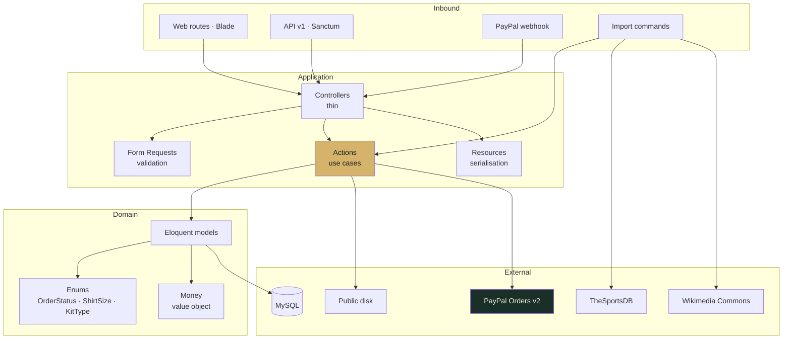

Controllers hold no business logic: they validate with a Form Request, delegate to an
Action and serialise with a Resource. The only interface in the project is
`PaymentGateway`, and it exists so PayPal can be swapped for a double in the tests.

**There are no repositories over Eloquent.** Eloquent *is* the repository; wrapping it
adds a layer that decouples nothing real.

---

## Data model

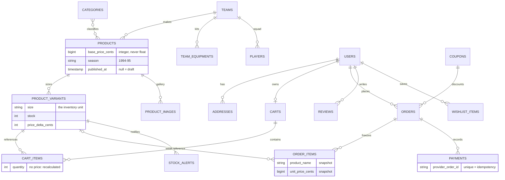

Four rules hold up everything else:

| Rule | Why |
|---|---|
| Money as integer cents | `float` loses precision as soon as you add |
| `order_items` stores a snapshot | A past order cannot change because the catalogue did |
| `cart_items` stores **no** price | A cart is an intention; an order is a contract |
| The cart references the *variant* | Size is the inventory unit, not an attribute |

---

## Order lifecycle

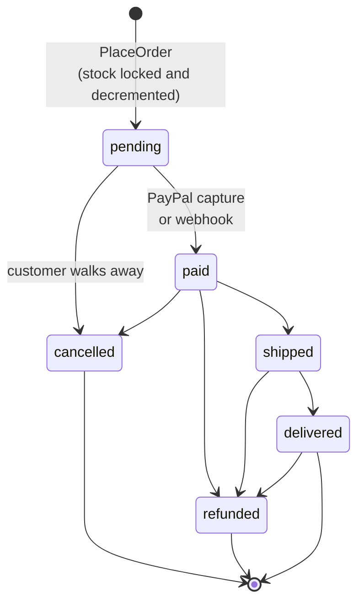

The state machine lives in `OrderStatus::canTransitionTo()`, not in the controller and
not in the form. A hand-rolled `POST` with an arbitrary status is rejected exactly like
a click in the interface.

---

## Checkout and payment

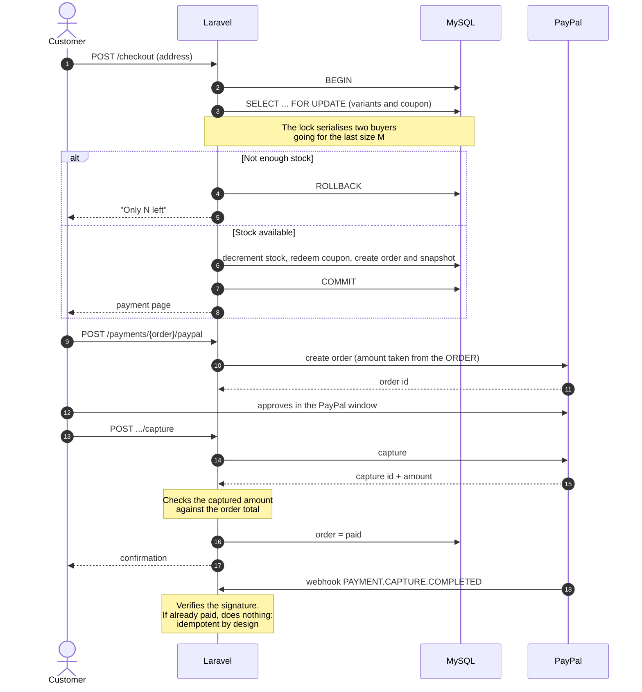

The browser never sees or sends an amount. The only thing it can manipulate is the
PayPal order id, and the server checks that against the order before treating anything
as paid.

---

## Cart

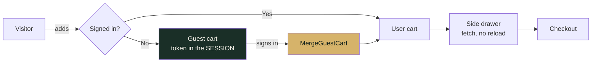

The guest cart token lives in the session, **never** in the URL and never in a cookie of
its own. If the client could choose it, changing that value would mean reading and
emptying somebody else's cart: a textbook IDOR, and the most common flaw in hand-rolled
carts.

---

## Importing from external APIs

The catalogue is fed by **TheSportsDB** (kits, crests, squads) and **Wikimedia Commons**
(retro archive). This is the part of the system where content we do not control gets in.

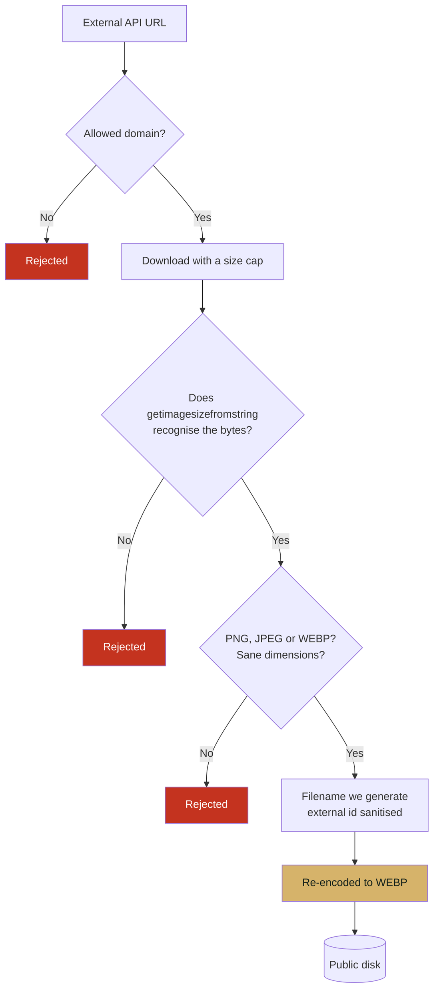

Everything goes through `RemoteImageStore`, and the principle is explicit: **an image
arriving over HTTP deserves no more trust than one a user uploads.**

There is a pixel cap as well as a byte cap: a 30 KB PNG can decompress to 40,000 ×
40,000 and exhaust memory during re-encoding.

---

## Back-in-stock alerts

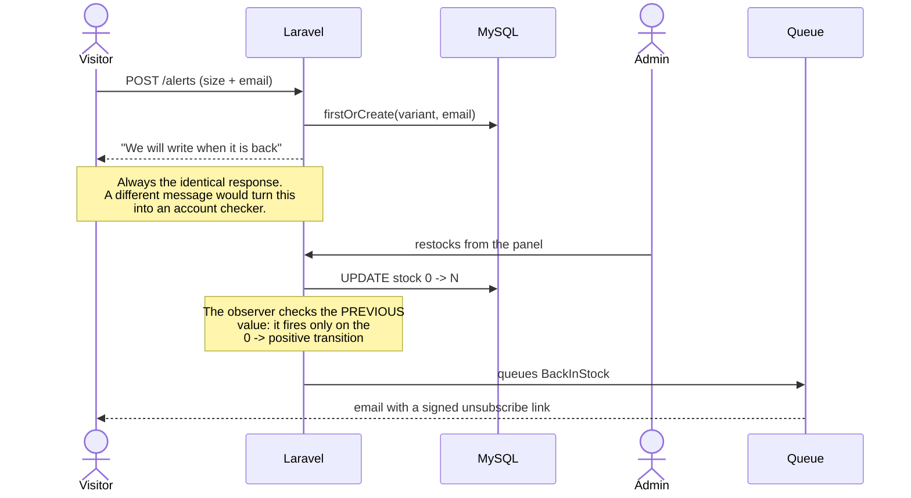

---

## Security

| Control | Where | What it closes |
|---|---|---|
| Cart ownership check | `CartController::authorizeItem()` | IDOR on cart lines |
| Guest token in the session | `CartResolver` | Cart theft by parameter tampering |
| Sort whitelist | `CatalogController::SORTS` | SQL injection via `orderBy()` |
| Escaping `%` and `_` | Catalogue and search | Dumping the catalogue with `?q=%` |
| `abort_unless` on `published_at` | `CatalogController::show()` | Drafts visible by guessing a URL |
| `is_admin` outside `#[Fillable]` | `User` | Privilege escalation from `POST /register` |
| 404 rather than 403 on `/admin` | `EnsureUserIsAdmin` | Panel enumeration |
| State machine in the enum | `OrderStatus` | Skipping the flow with a hand-made POST |
| `lockForUpdate()` on the order | `PlaceOrder` | Overselling under concurrency |
| `lockForUpdate()` on the coupon | `PlaceOrder` | Multiple redemption of a single-use code |
| Discount capped at the subtotal | `Coupon::discountFor()` | Negative totals |
| One message for any invalid code | `CouponController` | Brute-forcing coupons |
| Amount taken from the order | `PayPalGateway` | Client-side price tampering |
| Captured amount checked | `PaymentController` | Capturing below the total |
| `unique` on `provider_order_id` | `payments` table | Duplicate webhooks |
| Webhook signature verification | `PaymentController` | Forged webhooks |
| Sanitised filename | `RemoteImageStore` | Path traversal from an API response |
| Real byte verification | `RemoteImageStore` | `Content-Type` forged by the remote server |
| Re-encoding to WEBP | `RemoteImageStore` | Payloads behind a valid image header |
| Pixel cap | `RemoteImageStore` | Memory exhaustion on decompression |
| SVG rejected on upload | `ProductRequest` | XSS via a vector served from our own origin |
| CSP with nonce, no `unsafe-inline` | `SecurityHeaders` | Stored XSS |
| `report-uri` in the CSP | `SecurityHeaders` | A policy with no telemetry |
| `escapeHtml()` before `innerHTML` | `http.js` | XSS from the catalogue |
| Tags escaped in JSON-LD | `shop/show.blade.php` | XSS originating at TheSportsDB |
| YouTube id validated | `Team::youtubeId()` | Injection from a third-party URL |
| `Password::uncompromised()` | `RegisterController` | Already-breached credentials |
| Rate limiting per email + IP | `TokenController` | API brute force |
| One login error message | `TokenController` | User enumeration |
| Availability instead of stock | `ProductVariantResource` | Leaking business information |
| Identical response on alerts | `StockAlertController` | Account checking by email |
| Signed unsubscribe URL | `BackInStock` | Third-party forged unsubscribes |
| Audit log | `Auditable` | Changes with no identifiable author |
| Secrets excluded from the log | `Auditable::$auditExclude` | Leaking through the log itself |

The CSP only works because **there is no inline JavaScript in any view**. Gallery, cart,
search and filters all live in modules imported by Vite. Retrofitting that later is
expensive; doing it from the start is free.

---

## Bugs found and closed

The ones that teach something, with the real cause rather than the symptom.

**Filters returned nothing when combined.**
The condition was `$except !== 'tipo' && ($filters['tipo'] ?? null)`. In PHP, `&&`
**always** returns a boolean, so the `when()` closure received `true` instead of the
slug and the query compared `slug = 1`. With `decada`, `substr(true, 0, 3)` gave `'1'`
and `season LIKE '1%'` matched everything from 1970 to 1999, which is why it looked
half-working. It survived three reviews because no test checked that a filter *returned*
the right thing, only that the page loaded. `CatalogFilterTest` now covers it with eight
cases.

**Path traversal from an API response.**
The kit's external identifier was concatenated straight into the file path. An id
containing `../` in the response wrote outside the intended directory. A third party
controls it, not a user: exactly the kind of input people forget to validate.

**Stored XSS through JSON-LD.**
The structured data was serialised with `JSON_UNESCAPED_SLASHES` inside a `<script>`. A
`</script>` in a product name — and the names come from TheSportsDB — closed the block
and executed whatever followed.

**Silent mass assignment, three times.**
`notified_at`, `is_approved` and `redemptions_count` outside `$fillable` made `update()`
discard them without an error. The symptom was always the same: "this does not save and
gives no error". When an `update()` does nothing, `$fillable` is the first place to look.

**A directory where a file should have been.**
`phpstan.neon` includes `phpstan-baseline.neon`, but that name existed in the repository
as an empty directory. PHPStan aborts when it cannot read a file from `includes:`, so
the static-analysis job failed without producing a single analysis error — the message
said nothing about the code. Zips and Git do not preserve empty files, and an accidental
`mkdir` turns it into a folder.

**Tests running against the real database.**
`phpunit.xml` declared `DB_CONNECTION=sqlite`, but under Docker `env_file` injects the
`.env` as process variables and PHPUnit does not override them. The suite ran
`migrate:fresh` against MySQL and **wiped the development catalogue**. It is the same
cause that had CSRF active during tests and DNS validation making real queries: three
unrelated-looking symptoms, one configuration cause. `TestCase::refreshApplication()`
now forces in-memory SQLite before `RefreshDatabase` acts.

**Cascading catalogue deactivation.**
If the API returned no kits, the list of active ids came back empty, the filter was not
applied, and the `update` reached *every* product of the team. A temporary third-party
failure unpublished the whole catalogue with nothing flagging it.

---

## API

Full documentation in [`docs/openapi.yaml`](docs/openapi.yaml).

```bash
# Public catalogue
curl http://localhost:8000/api/v1/products?team=afc-ajax

# Token
curl -X POST http://localhost:8000/api/v1/tokens \
  -H 'Content-Type: application/json' \
  -d '{"email":"you@example.com","password":"...","device_name":"cli"}'

# Orders
curl http://localhost:8000/api/v1/orders -H 'Authorization: Bearer <token>'
```

Versioned from day one: `/api/v1` means a v2 can ship without breaking whoever already
consumes the current one. Adding the version afterwards costs far more.

---

## Quality

```bash
docker compose exec app php artisan test
docker compose exec app vendor/bin/phpstan analyse --no-progress
docker compose exec app vendor/bin/pint --test
docker compose exec app composer validate --strict --no-check-publish
docker compose exec app composer audit --locked --no-interaction
npm ci && npm run build && npm audit --audit-level=high
```

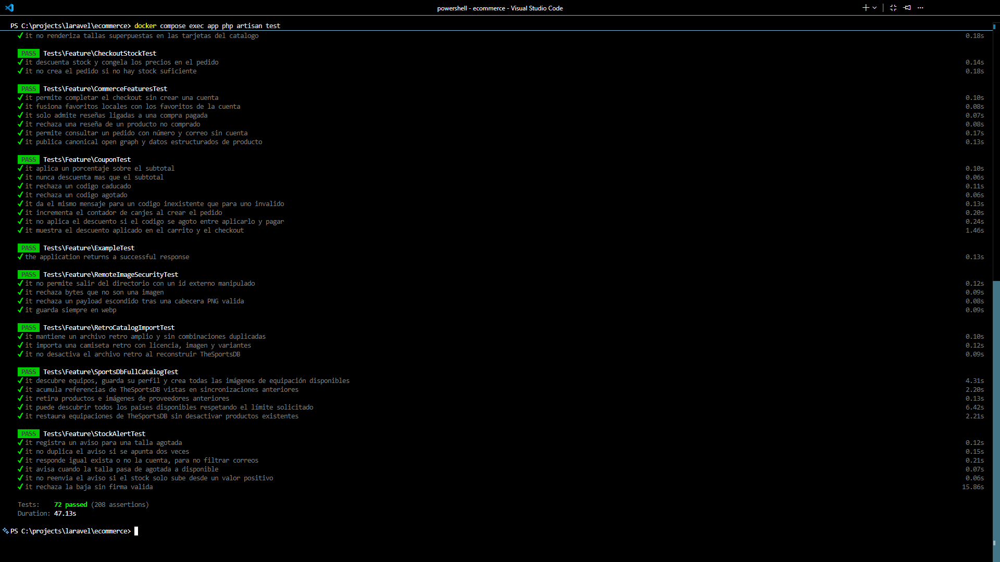

CI on GitHub Actions: the suite over in-memory SQLite, migration validation against
MySQL 8.4, Larastan level 5 with an incremental baseline, Pint, and a PHP/npm dependency
audit. New errors not in the baseline block the push.

---

## Structure

```
app/
├── Actions/          use cases (PlaceOrder, AddItemToCart, MergeGuestCart)
├── Console/Commands/ catalogue importers
├── Contracts/        PaymentGateway
├── Enums/            OrderStatus, ShirtSize, KitType, CouponType
├── Http/
│   ├── Controllers/  web, Admin/, Api/V1/
│   ├── Middleware/   EnsureUserIsAdmin, SecurityHeaders
│   ├── Requests/     validation
│   └── Resources/    JSON serialisation
├── Models/           Eloquent
├── Notifications/    BackInStock
├── Observers/        ProductVariantObserver
├── Services/
│   ├── PayPal/       gateway client
│   └── SportsData/   TheSportsDB, Commons, RemoteImageStore
├── Support/          Money, CartResolver, CouponSession, ShirtRenderer
└── Traits/           Auditable

resources/
├── js/               http, cart, search, gallery, filters, product, toast
├── sass/             _tokens, _variables, _components, app
└── views/            shop/, account/, admin/, partials/

docker/               nginx and php.ini
docs/                 openapi.yaml and screenshots
```

---

## What is next

1. **TOTP 2FA on the admin panel**, with recovery codes.
2. **Reviews with prior moderation** rather than automatic approval.
3. **PDF invoices** with sequential numbering.
4. **Meilisearch** for the search box: `LIKE` with a leading wildcard cannot use an index
   and does not scale.

---

## License

MIT. The shirts, crests and club names belong to their owners; this project is a
technical demonstration with no commercial purpose.
